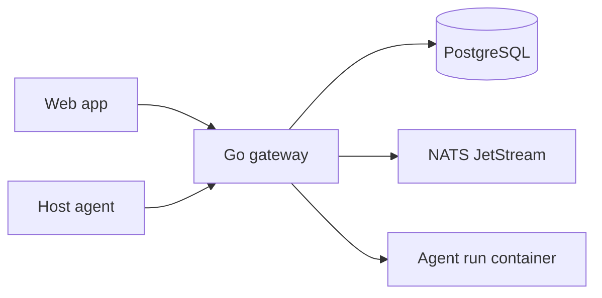

<p align="center">
  
</p>

<p align="center">
  A self-hosted workspace where your team and its AI agents share one engineering context.
</p>

<p align="center">
  <a href="https://github.com/runspace-io/runspace/actions/workflows/quality.yml"></a>
  <a href="LICENSE"></a>
  <a href="https://runspace.io"></a>
</p>

Runspace brings your whole team into one workspace — the people, your own AI
agents, and your teammates' agents — all working against the same repositories
and shared channels, with a live activity timeline everyone can see. Share a
local agent or a connected resource into a channel and the rest of the team, and
their agents, can see it and build on it.

Hand an agent a task against a real repository, watch it work in an isolated
container, step in through the terminal when you need to, review the diff, and
open a pull request — without ever leaving the workspace. Agents show up as
collaborators with their own identity and scoped permissions, not as a chat box
bolted onto your editor.

Everything runs on infrastructure you control. Your source and credentials never
leave your machine.

> [!IMPORTANT]
> Runspace is under active development. The default Compose setup is meant for
> local evaluation, not an internet-facing production deployment.

## Why it's different

- **Shared context, not silos.** A resource graph over your repos, issues, and
  tools gives every human and agent the same view of the work — and hands agents
  that context over MCP.
- **Repository truth, not chat theater.** Files, diffs, commands, commits, and
  PR state are first-class. Chat explains the work; it doesn't replace it.
- **You stay in control.** Every run exposes its status, inputs, outputs,
  permissions, and a stop button that actually kills the container.
- **Real isolation.** One non-root container per run, resource limits, no Docker
  socket, run-scoped credentials that get redacted from output.
- **Live by default.** Run status, agent messages, logs, and file changes stream
  in over WebSockets — no refreshing, no polling.
- **Bring your own agent.** Any [ACP](https://agentclientprotocol.com/)-compatible
  runtime plugs in; a mock runtime is built in so you can try the UI with zero
  setup.

## Quick start

You need [Git](https://git-scm.com/) and Docker with the Compose v2 plugin
(Docker Desktop on Windows/macOS).

```bash
git clone https://github.com/runspace-io/runspace.git
cd runspace
pnpm stack:up
```

`stack:up` writes `.env` from `.env.example` on first run, then builds and
starts everything. Plain `docker compose up -d --build` still works if you
would rather not go through pnpm.

Open [http://localhost:3000](http://localhost:3000) and sign in with
`admin` / `admin`.

The secrets in `.env.example` are local-only. Before sharing a deployment,
replace `LOCAL_AUTH_USERS`, `NEXTAUTH_SECRET`, `CHANNEL_SECRET_KEY`, and the
database password. Everything else lives in `.env` — see
[`.env.example`](.env.example) for the full list.

To confirm the stack is healthy:

```bash
docker compose ps
pnpm stack:smoke
```

## Plug in a real agent

Out of the box, `ACP_COMMAND` is empty and the gateway uses its built-in mock
runtime — enough to explore the whole workflow. Point `ACP_COMMAND` at any
[Agent Client Protocol](https://agentclientprotocol.com/) runtime and restart
the gateway to run a real agent.

To give an agent access to approved local folders and installed tools, run the
host agent alongside the stack:

```bash
pnpm host-agent
```

It binds to `127.0.0.1:7799` only. You approve folders one at a time from the
web app — the rest of your filesystem stays off-limits.

## How it works



Runspace is event-driven because agent work is long-running and stateful.
Commands go through a Go gateway; state changes land in PostgreSQL and fan out
over NATS JetStream so every connected client sees them live. Each run gets a
fresh checkout from a cached bare mirror and executes in its own container.

The stack: **Next.js + TypeScript** on the front (Monaco diffs, xterm.js
terminal, TanStack Query), a **Go** gateway and agent runner on the back,
**PostgreSQL** as the system of record, **NATS JetStream** for realtime events,
and **Docker** for run isolation.

## Development

Hot-reload everything in containers:

```bash
pnpm stack:dev     # same project as stack:up, so it replaces those containers
pnpm stack:logs    # follow output
pnpm stack:down    # stop
```

Prefer local tooling? Install Node.js 22, pnpm 10.30.3, and Go 1.25:

```bash
corepack enable
pnpm install --frozen-lockfile
pnpm dev
```

Before you push:

```bash
pnpm quality       # Prettier, lint, typecheck, tests, and web build
go test ./...      # Go tests
pnpm test:e2e      # Playwright; starts the dev stack for you
```

`pnpm run` lists every script. The end-to-end suite needs the host agent
running (`pnpm host-agent`) for the tests that exercise local resources.

`pnpm quality` also runs `staticcheck` and `golangci-lint`, and the same gates
run in CI on every push and pull request. Deeper design docs — architecture,
event model, and API contracts — live in [`docs/`](docs/).

## Contributing

Contributions are welcome. Read [CONTRIBUTING.md](CONTRIBUTING.md) before opening
a pull request, report security issues through [SECURITY.md](SECURITY.md), and
follow the [Code of Conduct](CODE_OF_CONDUCT.md).

Runspace is available under the [MIT License](LICENSE).
